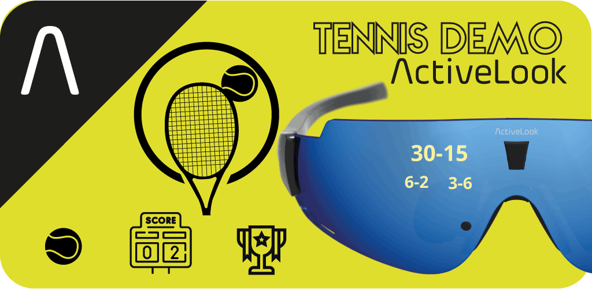

# ActiveLook® TENNIS

Description : Keep the score of your tennis match in your Augmented Reality ActiveLook® sport glasses

<p align="center"> 
The application can be found on GooglePlay :
    https://play.google.com/store/apps/details?id=com.ActiveLookTennis.demo 

    
### License

```
Licensed under the Apache License, Version 2.0 (the “License”);
you may not use this file except in compliance with the License.
You may obtain a copy of the License at
    http://www.apache.org/licenses/LICENSE-2.0
Unless required by applicable law or agreed to in writing, software
distributed under the License is distributed on an “AS IS” BASIS,
WITHOUT WARRANTIES OR CONDITIONS OF ANY KIND, either express or implied.
See the License for the specific language governing permissions and
limitations under the License.
```

### Requirements

You will need the following:
- A pair of ActiveLook® glasses
- Android Studio
- An android phone/watch with BLE

Known supported glasses :
- Julbo EVAD-1 : Premium smart glasses providing live data for intense sporting experiences (https://www.julbo.com/en_gb/evad-1)
- Engo 1 : Cycling & Running action glasses (http://engoeyewear.com/)
- Cosmo Connected : GPS & cycling (https://cosmoconnected.com/fr/produits-velo-trottinette/cosmo-vision)

### File to create and add at the root : .env

First, you need to add a file called '.env' at the source of the project. This file will contain only 2 lines :
```
ACTIVELOOK_SDK_TOKEN = ""
ACTIVELOOK_CFG_PASSWORD = 0xDEADBEEF
```

### Main files to modify

The name of the app is defined in the strings.xml file.

* app\src\main\res\layout\content_scrolling.xml
* app\src\main\res\values\strings.xml
* app\src\main\java\com\ActiveLookTennis\demo\MainActivity.java

In order to get the best performances, the ActiveLookSDK directory should be the latest release from : https://github.com/ActiveLook/android-sdk

### detailed description of this Android application

This "ActiveLook® Tennis" application connects to Activelook® smart glasses to display, live, and right in your field of vision, the key information you need to keep you always informed.

The application will first pair via BTLE with your Activelook® smart glasses.

This application is dedicated to tennis players and will always give you the match score in your eyes.

Usage :
- place your left hand in front of your left eye once : it increase the score of the player A
- place your left hand in front of your left eye twice (within 1sec) : it increase the score of the player B

It takes in account tennis matches in 2 or 3 winning sets. You can also change the names of the players A and B.
